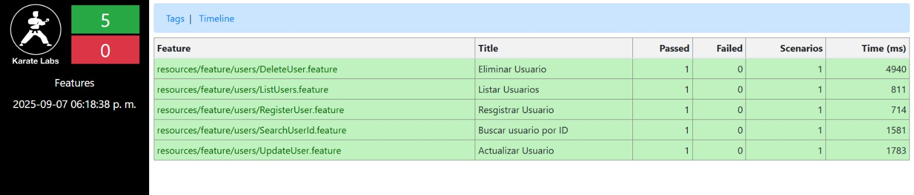
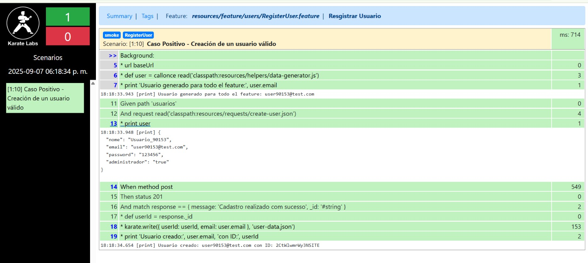
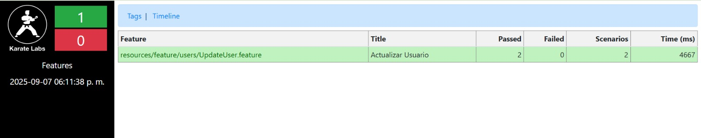
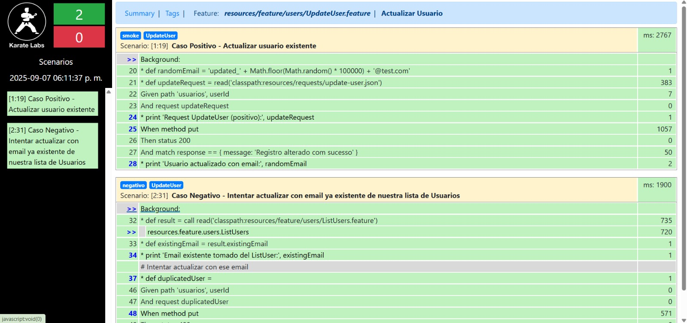
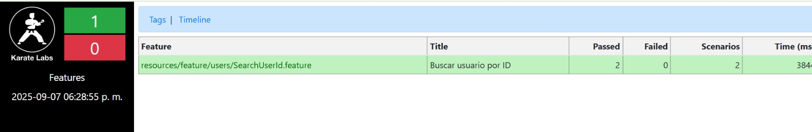
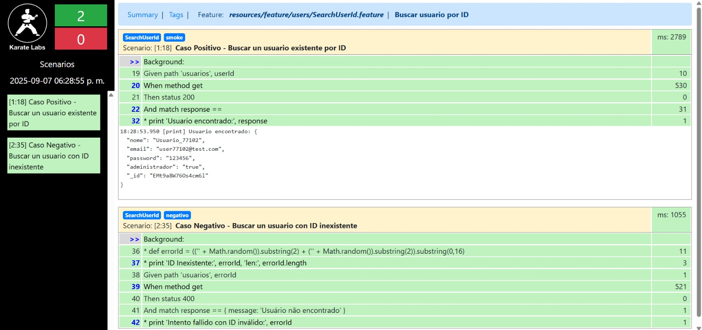

<h1>Automatización ServeRest – API (Karate)</h1>

Suite de pruebas API sobre <code>https://serverest.dev</code> usando Karate + JUnit 5 + Maven.

<h2>Requisitos</h2>
<ul>
  <li>Java 11+ (probado con <strong>JDK 21</strong>).</li>
  <li>Maven 3.8+.</li>
</ul>

<h2>Configuración</h2>
<ol>
  <li>Clona o descomprime el proyecto.</li>
  <li>(Opcional) Ajusta el endpoint en <code>karate-config.js</code>:
    <pre><code>// src/test/java/karate-config.js  (o src/test/resources/karate-config.js)
function fn() {
  var config = {};
  // Permite override desde CLI: -DbaseUrl=https://&lt;otro&gt;
  config.baseUrl = karate.properties['baseUrl'] || 'https://serverest.dev';
  return config;
}
</code></pre>
  </li>
</ol>

<h3>Etiquetas usadas</h3>

  @RegisterUser
  @UpdateUser
  @SearchById
  @ListUsers
  @DeleteUser
  @smoke
  @negativo

La etiqueta <code>@smoke</code> marca solo los escenarios felices.

La etiqueta <code>@negativo</code> marca solo los escenarios con error

<h2>▶️ Ejecución</h2>

<h3>Opción 1 — Todo el suite (paralelo)</h3>

Ejecuta todos los <code>.feature</code> bajo <code>resources/feature/users</code> vía el runner JUnit:

<pre><code>mvn --% -Dtest=runner.RunnerTest test
</code></pre>

<h3>Opción 2 — Por etiqueta</h3>
<pre><code># Solo escenarios felices @smoke
mvn --% -Dtest=runner.RunnerTest -Dkarate.options="--tags @smoke" test</code></pre>

# Un endpoint específico
mvn --% -Dtest=runner.RunnerTest -Dkarate.options="--tags @UpdateUser" test
</code></pre>

<h3>Opción 3 — Un feature específico</h3>
<pre><code>mvn --% -Dtest=runner.RunnerTest -Dkarate.options="classpath:resources/feature/users/SearchUserId.feature" test
</code></pre>

